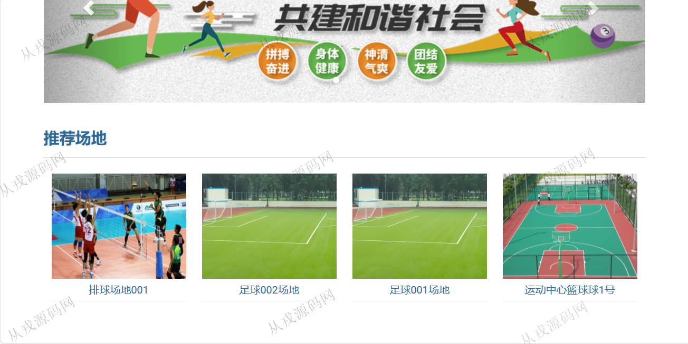

<h1 align="center">151.体育馆在线预订管理系统</h1>

- <b>完整代码获取地址：从戎源码网 ([https://armycodes.com/](https://armycodes.com/))</b>
- <b>技术探讨、资料分享，请加QQ群：692619798</b> 
- <b>作者微信：19941326836  QQ：952045282</b> 
- <b>承接计算机毕业设计、Java毕业设计、Python毕业设计、深度学习、机器学习</b>
- <b>选题+开题报告+任务书+程序定制+安装调试+论文+答辩ppt 一条龙服务</b>
- <b>所有选题地址 ([https://github.com/YuLin-Coder/AllProjectCatalog](https://github.com/YuLin-Coder/AllProjectCatalog)) </b>

## 项目介绍
基于ssm的体育馆在线预订管理系统：前端 jsp、jquery，后端 springmvc、spring、mybatis；集成场地预定、我的订单、通知等功能于一体的系统。

## 功能介绍

### 用户

- 基本功能：登录、注册、退出
- 网站首页：主导航栏，轮播图，全局搜索（模糊搜索场地名称），推荐场地
- 场地预定：全部场地列表展示，场地详情，预定项目查询，在线预定，发布评论
- 通知：通知列表查询，通知详情查看
- 个人中心：个人信息查看与修改，密码修改
- 我的订单：订单信息查询，取消预订

### 管理员

- 用户管理：用户信息的增删改查
- 轮播图管理：轮播图信息的增删改查，该处轮播图对应首页的轮播图的展示
- 场地预定管理：订单列表查询，用户在前台预订后，管理员可以查看订单信息，对订单信息进行退订操作
- 场地预定统计：场地预定的数据进行统计列表展示
- 场地管理：场地信息的增删改查，场地图片上传，设定无效
- 通知管理：通知信息的增删改查

## 环境

- <b>IntelliJ IDEA 2021.3</b>

- <b>Mysql 5.7.26</b>

- <b>Tomcat 7.0.73</b>

- <b>JDK 1.8</b>

## 运行截图

